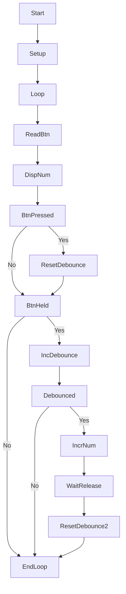

# LAB: GPIO Digital InOut 7-segment(eval board)

## LAB: GPIO Digital InOut 7-segment

**Date:** 2025-09-19

**Author/Partner:** leejeayong

**Github:** https://github.com/passtock/EC-jylee-561/blob/main/lab/LAB_GPIO_7segment/LAB_GPIO_7segment.c

**Demo Video:**  https://youtu.be/V78XGcXHqnQ

**PDF version:**

## Introduction

In this lab, you are required to create a simple program to control a 7-segment display to show a decimal number (0\~9) that increases by pressing a push-button.

You must submit

* LAB Report (\*.pdf)
* Zip source files(lab\*\*\*.c, ecRCC2.h, ecGPIO2.h etc...).
  * Only the source files. Do not submit project files

#### Requirement

**Hardware**

* MCU
  * NUCLEO-F411RE
* Actuator/Sensor/Others:
  * eval board

**Software**

* PlatformIO, CMSIS, EC\_HAL library

## Exercise

Fill in the table

| **Port/Pin**    | **Description**              | **Register setting**                      |
| --------------- | ---------------------------- | ----------------------------------------- |
| Port B Pin 5    | Clear Pin5 mode              | GPIOB->MODER &=\~(3<<(5\*2))              |
| Port B Pin 5    | Set Pin5 mode = Output       | GPIOB->MODER \|=(3<<(5*2))
| Port B Pin 6    | Clear Pin6 mode              | GPIOB->MODER &=\~(3<<(6\*2)) 
| Port B Pin 6    | Set Pin6 mode = Output       | GPIOB->MODER \|=(3<<(6*2))
| Port B Pin Y    | Clear PinY mode              | GPIOB->MODER &=\~(3<<(y\*2)) 
| Port B Pin Y    | Set PinY mode = Output       | GPIOB->MODER \|=(3<<(y*2))
| Port B Pin 5\~9 | Clear Pin5\~9 mode           | GPIOB->MODER &=\~(3<<(9\*2)) 
|                 | Set Pin5\~9 mode = Output    | GPIOB->MODER \|=(3<<(9*2))
| Port X Pin Y    | Clear Pin Y mode             | GPIOX->MODER &=\~(3<<(Y\*2)) 
|                 | Set Pin Y mode = Output      | GPIOX->MODER \|=(3<<(y*2))
| Port B Pin5     | Set Pin5 otype=push-pull     | GPIOB->OTYPER =0<<5;
| Port B PinY     | Set PinY otype=push-pull     | GPIOB-> OTYPER =0<<Y;
| Port B Pin5     | Set Pin5 ospeed=Fast         | GPIOB->OSPEEDR =3<<(5*pin);
| Port B PinY     | Set PinY ospeed=Fast         | GPIOB-> OSPEEDR =3<<(Y*pin);
| Port B Pin 5    | Set Pin5 PUPD=no pullup/down | GPIOB->OTYPER =0<<5;
| Port B Pin Y    | Set PinY PUPD=no pullup/down | GPIOB-> OTYPER =0<<Y;

***

## Problem 0: Preparation

### Procedure

Complete the Tutorial: 7-segment Display.



You must check the 7-segment display can show all the number from 0 to 9.&#x20;

* Give 'HIGH' signal to each 7-segment pin of 'a'\~'g'
* Observe if that LED is turned ON or OFF
* Check another 7-segment display leds
  * Example: Connect VCC to all 'a'\~'g' pins

Complete the required functions that displays numbers on 7-segment FND.

These functions must be moved to   `ecGPIO2.h,ecGPIO2.c`

Update your library header

* **ecGPIO2.h, ecGPIO2.c**

&#x20;

```c
// Initialize 7 DOUT pins for 7 segment leds
void seven_seg_FND_init(void); 

// Select display: 0 to 3
// Display a number 0 - 9 only
void seven_seg_FND_display(uint8_t  num, uint8_t select);

```

## Problem 1: Display a Number with Button Press <a href="#problem-1-display-a-number-with-button-press" id="problem-1-display-a-number-with-button-press"></a>

### Procedure <a href="#procedure-1" id="procedure-1"></a>

Create a new project under the directory `\repos\EC\lab\LAB_GPIO_7segment`&#x20;

* The project name is “**LAB\_GPIO\_7segment”.**
* Create a new source file named as “**LAB\_GPIO\_7segment.c”**
* Update  `platformio.ini` for VS.Code :  [Read here for detail](https://ykkim.gitbook.io/ec/ec-course/tutorial/tutorial-platformio-in-vscode)

\
Create a code that increases the displayed number from 0 to 9 with each button press.

* After the number '9', it should start from '0' again.

***

### Configuration

Configure the MCU GPIO

| Digital In for Button (B1) | Digital Out for 7-Segment                                                                                                   |
| -------------------------- | --------------------------------------------------------------------------------------------------------------------------- |
| Digital In                 | Digital Out                                                                                                                 |
| PA4                        | <p>PB7,PB6,PB5,PB4,PB3,PB2,PB1,PB0<br>('a'\~'h', respectively)<br>PC3,PC4,PA11,PA10<br>('FND\_0'\~FND\_3, respectively)</p> |
| PULL-UP                    | Push-Pull, No Pull-up-Pull-down, Medium Speed                                                                               |

### Code

[**Sample Code**](https://ykkim.gitbook.io/ec/stm32-m4-programming/example-code#seven-segment).

```c
#include "stm32f4xx.h"
#include "ecGPIO2.h"
#include "ecRCC2.h"

#define BUTTON_PIN PA_4

void setup(void){
    // Intialize System Clock
    RCC_HSI_init();
    GPIO_init(BUTTON_PIN, INPUT);  // calls RCC_GPIOC_enable()
    // and Others
    // [YOUR CODE GOES HERE]    
    seven_seg_FND_init(); 
};

int main(void) {
    setup();
    uint8 numDisplay=8;
    uint8 selectFND=0;

    while (1) {
        // [YOUR CODE GOES HERE]    
        seven_seg_FND_display(numDisplay,selectFND);
        // [YOUR CODE GOES HERE]    
        // [YOUR CODE GOES HERE]    
    }
}
	


```

Your code goes here: [ADD Code LINK such as github](https://github.com/passtock/EC-jylee-561/blob/main/include/ecGPIO2.c)

> this code uses for 7segments controll, write right number to 7segment display.

```
void  seven_seg_FND_init(void){

//pin name array

PinName_t  pinsFND[12]={PB_7, PB_6, PB_5, PB_4, PB_3, PB_2, PB_1, PB_0, PC_3, PC_4, PA_11, PA_10};
//Iteratively initializing DOUT pins for pinsFND
for(int  i=0; i<12; i++){
GPIO_init(pinsFND[i], OUTPUT); // Set as Output
GPIO_write(pinsFND[i], LOW); // turn off all segments and FNDs
}
}

void  seven_seg_FND_display(uint8_t  num, uint8_t  select){

PinName_t  pinsSEG[8] = {PB_7, PB_6, PB_5, PB_4, PB_3, PB_2, PB_1, PB_0};
PinName_t  pinsFNDselect[4] = {PA_10, PA_11,PC_4, PC_3};

int  segment[10][8] = {
{0, 0, 1, 1, 1, 1, 1, 1}, // 0
{0, 0, 0, 0, 0, 1, 1, 0}, // 1
{0, 1, 0, 1, 1, 0, 1, 1}, // 2
{0, 1, 0, 0, 1, 1, 1, 1}, // 3
{0, 1, 1, 0, 0, 1, 1, 0}, // 4
{0, 1, 1, 0, 1, 1, 0, 1}, // 5
{0, 1, 1, 1, 1, 1, 0, 1}, // 6
{0, 0, 0, 0, 0, 1, 1, 1}, // 7
{0, 1, 1, 1, 1, 1, 1, 1}, // 8
{0, 1, 1, 0, 1, 1, 1, 1} // 9
};//2d array to output led but  in this case i dont use.

uint8_t  segs[10]={
// 01234567
0b11111100, // 0
0b01100000, // 1
0b11011010, // 2
0b11110010, // 3
0b01100110, // 4
0b10110110, // 5
0b10111110, // 6
0b11100000, // 7
0b11111110, // 8
0b11110110 // 9
}; // 1d array to output i don't know why but order of each leds is opposited.

for(int  j =0; j<8; j++){
GPIO_write(pinsSEG[j], (segs[num] >> j) & 0x01); // turn on/off segment
}
GPIO_write(pinsFNDselect[select], HIGH);

 
}
```

Your code goes here: [ADD Code LINK such as github](https://github.com/passtock/EC-jylee-561/blob/main/lab/LAB_GPIO_7segment/LAB_GPIO_7segment_2.c)


>from the input number, once push the button number increase 1 by 1  at  user's input led stage.

```
#include "stm32f4xx.h"
#include "ecGPIO2.h"
#include "ecRCC2.h"


#define BUTTON_PIN   PA_4


void setup(void){
   GPIO_init(BUTTON_PIN, INPUT);
   GPIO_pupd(BUTTON_PIN, 0); // no Pull-up pill down

    // Intialize System Clock
    RCC_HSI_init();
    GPIO_otype(BUTTON_PIN, 0); // Push-Pull
    GPIO_ospeed(BUTTON_PIN, 1); 

    // Intialize DOUT Pins      
    // and Others  
    seven_seg_FND_init(); 
};

int main(void) {
    setup();
    int buttonState = 0;
    int prevButtonState = GPIO_read(BUTTON_PIN);
    int debounceCounter = 0;
    const int DEBOUNCE_THRESHOLD = 500; 
    uint8_t numDisplay=8;
    uint8_t selectFND=0;
   while(1){
        buttonState = GPIO_read(BUTTON_PIN);
        seven_seg_FND_display(numDisplay,selectFND);

        if (buttonState == 0 && prevButtonState == 1) {
            debounceCounter = 0; // Reset counter on button press
        }

        if (buttonState == 0) {
            debounceCounter++;// Increment counter while button is pressed
        }

        if (debounceCounter > DEBOUNCE_THRESHOLD) {
            numDisplay = (numDisplay + 1) % 10; // Cycle through 0-9
            while(GPIO_read(BUTTON_PIN) == 0) {} // Wait for button release
            debounceCounter = 0;// Reset counter after action
        }

        prevButtonState = buttonState;
    }
   
}
```





### Results

Experiment images and results


Add [demo video link](https://youtu.be/V78XGcXHqnQ)

### Discussion

1. Analyze the result and explain any other necessary discussion.
	>As you can see from the picture and code, the number is 8 and the number is displayed on the far right of the screen. It goes up by 1 each time the button is pressed, and at 9, it goes to 0, so you can see that it keeps repeating from 0 to 9. Debouncing was applied to make the button press feel better.
2. Draw the truth table for the BCD 7-segment decoder with the 4-bit input.
>0b11111100, // 0  
>0b01100000, // 1  
>0b11011010, // 2  
>0b11110010, // 3  
>0b01100110, // 4    
>0b10110110, // 5  
>0b10111110, // 6  
>0b11100000, // 7  
>0b11111110, // 8  
>0b11110110 // 9  
3. What are the common cathode and common anode of 7-segment display?

> In the common cathode type, all the cathodes (negative terminals) of the LED segments are connected together to a common pin, which is typically connected to ground,
> In the common anode type, all the anodes (positive terminals) of the LED segments are connected together to a common pin, which is typically connected to Vcc (positive supply voltage) 

4. Does the LED of a 7-segment display (common anode) pin turn ON when 'HIGH' is given to the LED pin from the MCU?

>No. With a common-anode 7‑segment display, a segment turns ON when the MCU drives that segment pin LOW (sinks current); driving the pin HIGH turns the segment OFF.


'''


***

## Reference

Complete list of all references used (github, blog, paper, etc)


## Troubleshooting

(Option) You can write Troubleshooting section


